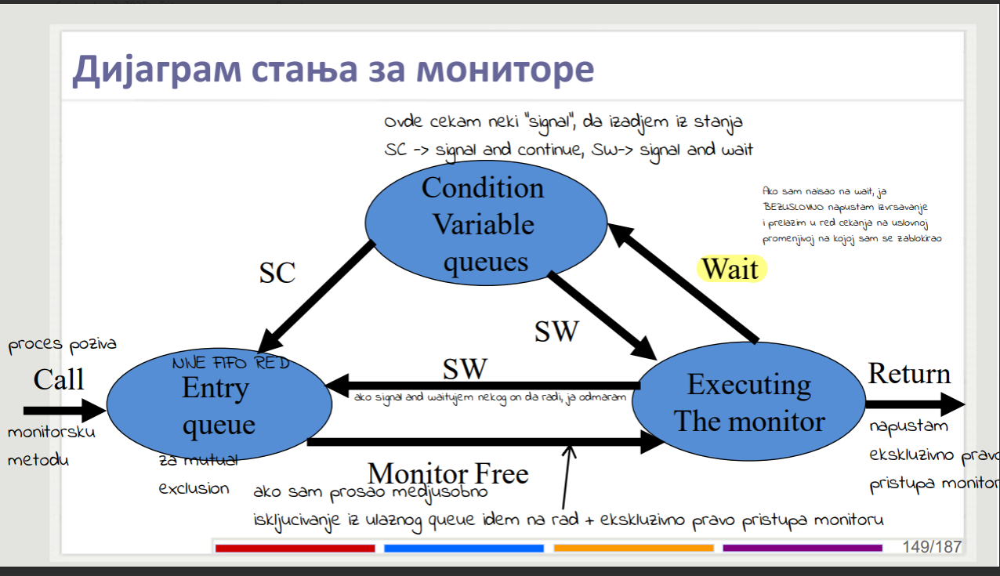
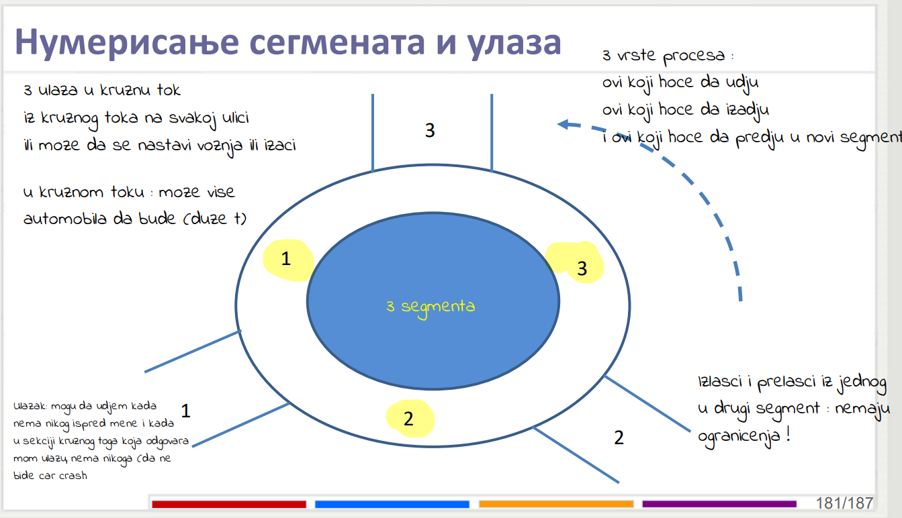

# Monitori
*Monitori* su moderni objektno orijentisani sinhornizacioni objekti (imaju svoje metode i polja) i sadrze sredstva za ostvarivanje sinhronizacije. Prave se tako da se svi konkretni sinhronizacioni koncepti sadrze unutar ovih klasa.

**Mehanizam apstrakcije** - sve sinhronizacione promenjime su nevidljive korisniku, njemu su poznate samo metode i jos neke stvari koje pomazu da bi se realizovala sinhronizacija, sama implementacija te sinhronizacije se ne vidi.

- Medjusobno iskljucivanje je implicitno obezbedjeno, kao < await >.
- Uslovna sinhronizacija, koriste se **condition promenjive**.

*Condition promenjive* sluze da se na njima procesi blokiraju ukoliko neki uslov nije zadovoljen. Svaka condition promenjiva sadrzi **queue** koji sadrzi procese koji su blokirani nad njom, po teoriji ovakvi redovi **NISU FIFO**.
| Metode nad condition<br> promenjivama        | empty(cv)           | wait(cv) invarijanta  |signal(cv)|
| ------------- |:-------------:| :-----:|:-------:|
||Ispituje da li neko<br> ceka u redu cekanja.|Odricanje ekskluzivnog <br> prava pristupa i pustanje<br> drugih procesa da udju.|Budi proces na pocetku reda cekanja, <Br>ukoliko je red prazan nema efekta|


Monitor koristimo samo preko njegovih procedura, i samo se jedna metoda datog monitora moze izvrsavati u jednom trenutku. Ona koja se izvrsava korisniku garantuje ekskluzivno pravo pristupa.

```cpp
monitor mname{
	#Declaracija stalnih promenjivih
	#Inicijalizacija
	#Procedure //Samo ovo koristimo
}
```
| Pristup        | Vidljivost           | Monitorska invarijanta  |Pristup|
| ------------- |:-------------:| :-----:|:-------:|
| Samo putem <br>procedura      | Unutar monitora <br> nema referenciranja<br> van monitora. | Smislena stanja u kojima monitor moze biti<br>npr ne moze da izadje iz autobosa<br> neko ko nije usao u njega. | Ako neki proces izvrsava metodu monitora<br> onda niko sem njega ne sme da<br> izvrsava tu metodu iste insance monitora ??
# Signal discipline
Postavlja se pitanje, sta kada signal treba da probudi drugi proces ?

Postoja dva osnovna ponasanja monitora nakon sto se desi signal a to su:
- Signal and continue disciplina
- Signal and wait disciplina

**Entry queue:** Svaki monitor kao struktura ima interno jedan atribut koji je *red za procese* i tu se stavljaju u red za cekanje svi procesi koji zele da pristupaju monitoru (razlikuje se od condition queue, on je za uslovnu promenjivu samo ovo je za ceo monitor).
| Signal and continue        | Signal and wait           | Signal and urgent<br>wait|
| :-------------: |:-------------:|:-------------:|
|Budim nekoga iz reda na condition promenjivoj, i taj kojeg sam <br>probudio ide na entry queue a ja nastavljam|Ja odmah dajem nekom ekskluzivno<br> pravo pristupa nekom drugom koji je cekao u redu na uslovnoj promenjivoj i ja idem u <br>entry queue(al na rendom mestu u redu)|Isto kao signal and wait, samo sto mi je <br>garantovano da cu ja biti prvi sledeci koji ce<br> pristupiti monitoru na cijem sam entry queueu|

**PODSEDNIK**: Ja u red uslovne promenjive idemo samo kada se okine conditionVariable.wait() !!!


Da sumiramo, redovi koji postoje su:
- Entry: Postoji da se u njega redjaju procesi koji dolaze na ulaz monitora da bi obezbedio medjusobno iskljucivanje,nije FIFO.
- CV (Condition Variable queueus) redovi, redovi za suspendovana procese (procesi koji su pojeli taj wait()) i tu cekaju na ispunjenje uslova, nije FIFO.
- Urgent Queue, za implementiranje urgent waita, FIFO ?!.

## Implementacija signal and wait monitora pomocu semafora

```cpp
sem mutex;
typedef struct{
	sem CV_sem = 0; //Ovo je zapravo kao red za cekanje, sto je veci
	int count=0; //Broj procesa koji cekaju nad ovom CV

	void wait(){
		count++; //Povecaj broj niti koji ceka nad CV
		signal(mutex);//Posto ja cekam, dopusti da neko drugi pristupa monitoru.
		wait(CV_sem); //Cekaj na CV
		wait(mutex); //Kada prodje CV_Sem, pre nego sto nastavim mora da budem siguran da sam dobio mutex nazad.
		count--; //Smanji broj blokiranih, jer sam prosao CV_sem
	}
	void signal(){
		if(count > 0){
			signal(CV_sem); //Probudi nekog sa reda CV_sem
		}
	}
}cv;
class Monitor{
	cv ConditionVariable;
	void procedure(){
		wait(mutex); //Svaka procedura pocinje sa wait(mutex)
		#CRITICAL_SECTION
		signal(mutex);//Svaka se zavrsava sa wait(mutex)
	}
}

```
## Signal and urgent wait preko semafora
```cpp
sem mutex = 1;
typedef struct{
	sem U_sem = 0;
	int count = 0;
}urgent;

typedef struct{
	sem CV_sem = 0;
	int count = 0;

	void wait(){
		count = count + 1;
		if (uq.count > 0) signal(uq.U_sem);
		else signal(mutex);
		wait(CV_sem);
		count--;
	}

	void signal(){
		if(count > 0){
			uq.count++;
			signal(CV_sem);
			wait(uq.U_sem);
			uq.count--;
		}
	}
}cv;

static urgent uq;

class Monitor{
	cv conditionVariable;
	void procedure(){
		wait(mutex);
		//Critical section
		if(uq.count > 0)signal(uq.U_sem);
		else signal(mutex);
		
	}
}

```
## Semafor preko monitora
### Signal and wait monitor
```cpp
monitor Semaphore(){
	int s = 0;
	Cond c;
	procedure semWait(){ //Kako je ovo monitor, sve u ovim zagradicama je ekskluzivno pristupanje.
	  * while(s==0)wait(c); //Moze if umesto while za signal and wait, kod signal and continue mora WAHILE!
		s = s - 1;
	}
	procedure semSignal(){
		s = s + 1; //Pazi na redsosled, prvo ovo !
		signal(c); //Ako niko ne ceka ne desava se nista.
	}
}
```
Zasto kod signal and continue ne moze da stoji if(s==0) wait(c):
`Semaphore.semWait()` Ja
`Semaphore.semSignal()` Neki drugi proces, koji kad me prebacu u entry queue nastavlja da radi
`Semaphore.semWait()` Proces koji pristize na entry queue dok ja cekam, a ovaj signalizator jos radi u monitoru nakon sto me je prebacio
Moze izazvati nekonzistentno stanje ukoliko se radi signal i continue, naime kada se desava semWait, mi cemo se na wait(c) prebaciti u red cekanja na condition promenjivoj. Nako toga (mi i dalje cekamo na condition promenjivoj) desava se signal (mi prelazimo u entry queue, ali nam je kontekst i dalje na liniji(*)). Proces koji je pozvao signal i dalje radi dok ne zavrsi(SC disciplina) i dok on zavrsava svoj posao moze se desiti da dodje neki proces takodje da trazi monitor, on odma ide na entry queue. 
Stanje bi bilo: Ja u entry queue(kontekst na *), novi proces u entry queue(nema kontekst od znacaja) i proces koji zavrsava svoj posao posle signal. Moze se desiti da kada proces zavrsi posao, postavlja s = 1, posto entry queue nije FIFO, da procesor prvo ode ovom novopristiglom procesoru, i recimo da on radi wait. Kada on uradi wait on, on ce proci jer je s = 1, i spustiti ga na 0. Kada dodje vreme da mi sa nasim kontekstom koji i dalje stoji na * i prolazi wait(ukoliko je bilo if) dolazi na liniju s = s -1 i postavlja vrednost s = -1 sto je wtf. **Zato stavljamo while(s == 0)**.

### Passing the condition
**Passing the condition** je tehnika u radu monitora gde se potencira da onaj koji *budi* (signalizira) uradi neki posao za onog *koga budi* (koji izlazi iz waita na CV).

```cpp
monitor Semaphore(){
	int s = 0;
	Cond c;
	procedure semWait(){ 
	  	if(s==0)wait(c); 
		else: s = s - 1; //Passing the condition treba da funkcionise samo kada se zablokiramo na wait, tada ovaj sto nas 
						 //budi radi posao za nas. Ako se ne blokiramo, prika ti radis posao u else.
	}
	procedure semSignal(){
		s = s + 1; 
		if(c.queue ()){//Prvo proveri da li imam za koga da odradim posao.
			s = s - 1; //Passing the condition, ja cu uraditi ovo za njega !
			signal(c); //Budi ga
		}
	}
}
```
Metoda semSignal moze i lepse da se napise, tako sto bi se u if-u obirsao ovaj s = s - 1 a ovaj s++ stavio u else granu. To bi doslo na isto jer kada if prodje one ce s, koji je u prethodnoj liniji bio uvecan za 1, sada smanjiti za 1(bespotrebne instrukcije). Onda s = s +1 ima efekta samo kada se ne bi ulazilo u if, a ove 2 ce biti bez efekta kada bi if bio zadovoljavajuc. Ali i ovo resenje radi.

*Ne treba ovde while*, i ovo sme da se koristi samo kada ove poslovi koje cu ja uraditi za tebe nemaju povratne vrednosti i ne sracunavaju nesto.

**Rank**  procesa kod monitora sluzi za odredjivane prioriteta, sto je rank manji proces ima veci prioritet izlazka iz reda cekanja na condition variablama.
| wait(cv,rank)        | signal_all(cv)           | minrank(cv)  |
| ------------- |:-------------:| :-----:|
| Prebacujemo proces u red cekanja na C.V. ali zadajemo<br> i rank (sto je rank manji pre ce se proces <br>probuditi i otici u entry queue).      | Svi procesi prelaze u entry queue, samo<br> kod SC discipline | Rank procesa na pocetku CV queue |
# Producers consumers (bounded buffer) problem
Znaci pravimo monitor sa dve metode, jedna je metoda deposit i verovatno ce je pozivati produceri i metoda fetch koju bi trebalo da pozivaju consumeri. Te metode ce sigurno obezbediti medjusobno iskljucivanje jer su monitorske metode, samo treba da napravimo da radi.
```cpp
#define N ...
monitor Bounded_Buffer{
	typeN buff[n];
	int front = 0;
	int rear = 0;

	Cond not_empty; //Cond promenjive se imenuju po situaciji koja ne izaziva wait.
	Cond not_full;

	int count = 0; //Koliko ima elemenata u buffer (nemamo vise semafore i njihove promenjive da bismo brojali)

	
	procedure deposit(typeT data){//Metoda koju poziva producer
		while(count == n)	wait(not_full); //While, jer SC ne radi sa IF, ista problematika kao i gore.
		buf[rear] = data;
		rear = (rear + 1) % n;
		count = count + 1 ;
		signal(not_empty);
	}

	procedure fetch(){//Metoda koju poziva consumer.
		while(count == 0) wait(not_empty);
		result = buf[front];
		front = (front + 1) % n;
		count = count - 1;
		signal(not_full);
	}
}
```
# Readers writers - broadcast signal
**Broadcast signal** jeste tehnika gde se istovremeno bude svi procesi koju su cekali na nekog uslovnoj promenjivoj koristeci metodu signalAll(c CondVariable).

```cpp
monitor RW{

	Cond okRead; //C.V. nad kojom cekaju citaoci.
	Cond okWrite; //C.V. nad kojom cekaju pisci.

	int writers; //Koliko pisaca koji PISU.
	int readers; //Koliko citalaca koji CITAJU.
	
	procedure startRead(){
		while(writers > 0) wait(okRead); //Radi za signal and wait sa if
		readers = readers + 1;
	};

	procedure startWrite(){
		while(writers > 0 or readers > 0) wait(okWrite);
		writers = writers + 1;
	};

	procedure endRead(){
		readers = readers - 1;
		while(readers == 0)signal(okWrite); //readers je uslovljavao wait(okWrite), zato njega signaliziram
	};
	
	procedure endWrite(){//Signall all radi samo za disciplinu SC, ako u zad traze SW snalazi se(if okRead.queue>0)okRead.signal();izgladni ga al radi
		writers = writers - 1;
		signal(oktowrite);
		signal_all(oktoread); //Nakon zavrsetka ove metode ce biti utrkivanje na entry queue 1 pisac i svi citaoci ko ce dobiti monitor.
	};

	main(){
		RW.startRead()
		
			#READ
		RW.endRead()
		...
		RW.startWrite()
			#WRITE
		RW.endWrite()
	}
	
}
```
**FIFO** resenje: Cesto kad se trazi fifo imamo 1 uslovnu promenjivu na kojoj blejimo i ciji red jeste FIFO + *passing the condition*.
```cpp
monitor RW{

	Cond ok; //FIFO
	List list; //Slicna ideja kao sa riders writerson i stafetnom palicom

	int writers; 
	int readers; 
	
	procedure startRead(){//Ako ima bilo ko da ceka, a ja hocu FIFO pa gde ja da prodjem, zato list.size > 0 ?
		if(writers > 0 or list.size() > 0) list.add('R');wait(ok);
		else readers = readers + 1; //Opusteni PASSING THE CONDITION
	};

	procedure startWrite(){
		if(writers > 0 or readers > 0 or list.size()>0) list.add('W');wait(ok);
		else writers = writers + 1; //PASSING THE CONDITION, ako se blokiram ocekujem da onaj koji me budi uradi moj posao
	};

	procedure endRead(){
		readers = readers - 1;
		if(list.size()>0){
			if(list.get(0) == 'R' ){
				readers = readers + 1; //Ja radim njegov posao
				signal(ok);
			}
			else if{list.get(0)=='W'and readers == 0}{
				writers = writers + 1;//Radi tudji code nigga
				signal(ok);
			}
		}
	};
	
	procedure endWrite(){
		writers = writers - 1;
		if(list.size()>0){
			if(list.get(0) == 'R'){
				readers = readers + 1; //Ja radim njegov posao
				signal(ok);
			}
			else if{list.get(0)=='W'}{
				writers = writers + 1;//Radi tudji code nigga
				signal(ok);
			}
		}
	};

	main(){
		RW.startRead()
		
			#READ
		RW.endRead()
		...
		RW.startWrite()
			#WRITE
		RW.endWrite()
	}
	
}
```
Zaha je ovo jos optimizovao ali to cu ostaviti za seks na vezbama.
# Shortest next allocation monitor
Ona prica sa semaforima, pravimo semafor ciji request prima parametar time, na osnovu kog ce se onda buditi procesi. Ovde je samo fora da imamo ovaj wait(trun,time) i da signal budi onaj ciji je time najmanji. Da bi ovo radilo sistem mora da implementira red za cekanje CV koji radi ovako i da navedene funkcije bas tako funkcionisu.
```cpp
monitor SJN{
	bool free = true;
	cond turn;

	procedure request(int time){
		if(free) free=false;
		else wait(turn,time); //Cudan neki wait xd
		
	}
	procedurer release(){
		if(turn.queue > 0) signal(turn);
		else free = true;
	}
}
```
# Interval timer monitor
Zelimo da napravimo sleep metodu za neki zadati interval.
```cpp

monitor Timer{
	int tod = 0; //Koliko je trenutno vreme
	cond check;

	procedure delay(int interval) {
		int wake_time = tod + interval;
		while(wake_time > tod){
			wait(check);
		}
	}

	procedure tick(){
		tod = tod + 1;
		signal_all(check); //Sporo bude se svi, zamisli budilnik te pita na sekund E JE L SAD USTAJES.
	}
}
```
Fix problema sa precestim budjenjem: imamo listu uredjenu po vremenima budjenja, i kada se ispostavi da je list.get(0) > tod, probudi, ali ovo zahteva da su redovi cekanja uslovnih promenjivih prioritetni.
```cpp

monitor Timer{
	int tod = 0; //Koliko je trenutno vreme
	cond check;

	procedure delay(int interval) {
		int wake_time = tod + interval;
		while(wake_time > tod){//Ovde stavljamo while, jer ako 2 procesa imaju isti sracunat wake_time, signal ce probuditi
								//samo prvog i nastace mali jaz, ali nece se nista mrtvo blokirati jer je uslov minrank < tod, samo ce 1 	iteracija biti poremecena
			
			
			wait(check, wake_time);//Koristimo prioritetne redove cekanja
		}
	}

	procedure tick(){
		tod = tod + 1;
		while(check.queue > 0 and minrank(check)<= tod) signal(check);//minrank vraca rank prvog procesa u redu, a posto je red prioritetan onda vraca ovog sa najmanjim rankom logicno(jer je on prvi xd)
	}
}
```
# Sleeping Barber RANDEZVOUS :D
`Berberin` - Jedan berberin kosi sisa ukoliko ima musterije za sisati, ukoliko nema koga da shisha on spava. Takodje na njemu je odgovornost da javi drugima kada zavrsi sa shishanjem da moze sledeci da udje. Jedan proces
`Musterija`- Hoce da se shisha, dolazi do berbernice i ukoliko ima mesta unutra za sedenje, ona ceka na svoj red, ukoliko nema samo se okrene i paljba. Njena odgovornost je da juri da sedne, ne ceka da je berberin prozove. Vise procesa.
`Brijanje`-proces se odvija van monitora, treba se obaviti nedeljivo (jedan proces se shisha).
Procedure
- get_haircut `Musterija poziva`
- get_next `Berberin poziva`
- finish `Berberin poziva`

**Randezvous** (*ping pong*)- barijera za dva procesa. U nasem slucaju brice i jednog klijenta. Funkcionise malo drugacije od obicne barijere, to je postupak gde jedan proces odradi neki posao, pa obavesti drugi. Onda kad drugi uradi neki posao obavesti prvog i tako u krug. Kada god hocemo da komuniciramo sa drugim procesom koristimo signal i wait.

Pomocne promenjive ?
- `barber`- Da li berberin moze da sisa ?
- `chair`-Da li je stolica slobodna ?
- `open` - Da li su vrata otvorena za izlaz.

```cpp
monitor Berbernica{
	int barber = 0;
	int chair = 0; 
	int open = 0;
	
	Cond barber_free;
	Cond chair_taken;
	Cond door_open; //Ovo kad je true, gotovi smo sa brijanjem
	Cond left; //Mora da sa sacekamo da musterija izadje pa onda da nastavimo
	
	procedure get_haircut(){//Musterija ceka berberina, i kada ga doceka zauzima stolicu nakon toga 
		//ceka da berberin zavrsi friz(to jest da otvori vrata = gotov friz) i onda kazemo berberinu da odlazimo
		while(barber == 0)wait(barber_free);
		barber = barber - 1;
		chair = chair + 1;
		signal(chair_taken);
		while(open == 0) wait(door_open);//Kad prodjemo wait napustili smo berbernizzu
		open = open - 1;
		signal(left);
		
	}
	procedure finish(){//Berberin obavestava da je zavrsio i ceka musterija da ode
		open = open + 1; //Zavrsio sam brijanje, pustam musteriju da izadje
		signal(door_open);
		while(open > 0) wait(left);//Cekam da musterija zapravo skroz ode iz berbernice
		
	}
	procedure get_next(){//Berberin slobodan i ceka da neko sedne da krene da radi
		barber = barber + 1;//Musterija otisla ja sam sad slobodan covek, ili sam tek otvorio salon
		signal(barber_free);
		while(chair == 0)wait(chair_taken);//Cekam da mi neko sedne u stolicu
		chair = chair - 1; //Neko je seo, zakljucaj lock.
	}
}

int main(){
	Berbernica b;
	b.get_next(); //Proces berberina
	b.get_haircut(); //proces musterije
	#MAJSTOR RADI NA NEJMARA
	b.finish();
}

```
# Roundabout problem
Problem kruznog toga: Posmatramo kruzni na koji mozemo uci iz *tri ulice*, i **prednost imaju vozila koja se nalaze u kruznom toku**.

Zahtevi:
- Potrebno je obezbediti ulazak, prateci da li ima nekog ko storji ispred nas na priljucnoj ulici
- Potrebno je obezbediti da mogu da udjem u kruzni tok samo ako sam prvi u ulici i nikog nema u segmentu (1. segment i 1 ulica mora da paze da ne bude ukljucenje dok nekog ima u segmentu 1 na slici, ali kad udjem u tok ulecem u segment 2).
- Auto u toku kada naidje na ulicu moze da bira da li ce se iskljuciti ili i dalje voziti tokom, ove odluke nemaju ogranicenja.
- Kada se prelazi iz segmenta u segment nema zadrzavanja monitora

Signal and wait resenje, SC je kompleksno:
```cpp
monitor roundabout{
	const N = 3; //Broj segmenata
	int count[N]; //Broj ljudi u SEGMENTU.
	CV enter[N];//Ovo su FIFO promenjive, da bi se odrzao redosled ovih sto cekaju u ulici da se ukljuce u tok
	procedure start(int segment){//Start je funkcija koja obezbedjuje ulaz u segment indeksiran sa segment iz ulice indeksirane sa segment.
		if(enter[segment].queue > 0 and count[segment] !=0){
			enter[segment].wait();
		}
		count[segment%n + 1]++;//Ako sam cekao u ulici 1, ulazim odmah u segment 2.
	}
	procedure leave(int segment){//Ako izlazim sa segmenta broj X, izlazim u ulicu broj X
		count[segment]--;
		while(count[segment == 0] and enter[segment].queue > 0) signal(enter[segment]);//Kada napustam segment, proveri da li sam poslednji i ako jesam 
									//PLUS neko zeli udje, obavesti ga da moze jer nema ko da ga ometa
	}
	procedure move(int segment){//Ako ne zelim da izadjem u ulicu X iz segmenta X, onda prelazim u segment Y=X+1
		count[segment]--;
		count[segment%n + 1]++;
		while(count[segment == 0] and enter[segment].queue > 0) signal(enter[segment]);// While jer je resenje SW !!!
	}
}
```


