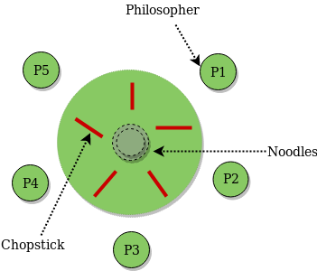

# Semafori

Strukture podataka koje sluze za medjusobno iskljucivanje izmedju procesa.  
Imaju jedan atribut i dve metode:

- Atribut **s**, atribut na kom se sinhronizujemo, ukoliko je >0 onda ima procesa koji su zauzeli semafor, 0 nema. Vrednost ovog atributa moze samo da se menja koristeci sledece dve metode.
- Metoda **signal(s)**, povecava s za 1, `<s = s + 1>`
- Metoda **wait(s)**, smanjuje s za 1, `<await (s > 0) s = s - 1>`

Konstruktor je najcesce tipa sem semaphore = X, gde je X inicjalna vrednost semafora.

*Binarni semafori* : Samo jedan proces se pusta da prodje, vrednost s ovog semafora uvek ima vrednosti 0 ili 1.!  
*Generalni semafori* : S moze da ide proizvoljno veliko, vise procesora moze da proje ovakav semafor, bude se najcesce u redosledu u kom pristignu.

| Mutex |     | Rasporedjeni bin. semafori |
| --- | :---: | --- |
| Binarni semafor kome je  <br>atribut S inicijalizovan na 1 |  | Vise semafora koji stite isti resurs  <br>gde u jednom trenutku samo<br> 1 moze imati vrednost 1,  <br>pored medjusobnog iskljucivanja  <br>obezbedjuju i uslovnu sinhronizaciju |

```
sem mutex = 1; //Mutex, inicijalizovan na 1
process CSi[i = 1 to n]{
    while(true){
        wait(mutex);
        #CRITICAL SECTION
        signal(mutex);
        #CRITICAL SECTION
    }
}
```

## Producers consumers - split binary semaphores

```cpp
typeT buf; //Ovo je primer kada imamo kapacitet za 1 element
sem empty = 1; //Nad ovim cekaju produceri, jer oni prvi treba da odrade posao, kad odrade signaliziraju full.
sem full = 0; //Ovde cekaju consumeri, kad konzumiraju signaliziraju empty.

process Produceri[i = 1 to M]{
    while(true){
        wait(empty); //Cekaj da consumer potrosi tvoj element pre nego sto napravis nov
        buf = data; //Kreiraj element
        signal(full); //Signaliziraj consumeru da si napravio element
    }
}

process Consumer[i = 1 to N--]{
    while(true){
        wait(full); //Cekamo da producer signalizira
        result = buf;//Sacuvaj element
        signal(empty); //Signaliziramo produceru da moze da pravi novi
    }
}
```

### Bounded buffer

Problem sa prethodnim resenjem je sto nama promenjiva *buf* ima kapacitet samo za jedan element. Ukoliko bi se budjenje procesa odigralo tako da se u nekoj periodu probudi vise proizvodjaca nego potrosaca, ubili bismo performanske jer vecina proizvodjaca mora da ceka, iako potrosaci ne rade (neki je vec popunio jedno mesto i nema progresije dok neki potrosac ne uzme taj element).  
**Bounded buffer**, red nekog kapaciteta u koji smestamo elemente i koji sadrzi dva pokazivaca:  
\-rear: Pokazivac na mesto u baferu gde se smesta podatak, `buf[rear] = data; rear = (rear + 1) % n`  
\-front: Pokazivac na mesto u baferu sa kojeg se uzima podatak, `result = buf[front]; front = (front + 1 ) % n`  


```cpp
typeT buf[n];
int front = 0;
int rear = 0;

sem empty = n; //Na pocetku ima N mesta, pa moze N procesa da prodje empty semafor.
sem full = 0;

process Produceri[i = 1 to M]{
    while(true){
        wait(empty);
        buf[rear] = data;
        rear = (rear + 1) % n //Ovo n je velicina bafera, nema veze sa brojem procesa.
        signal(full);
    }
}

process Consumer[i = 1 to T]{
    while(true){
        wait(full);
        result = buf [front];
        front = (front + 1) % n //Ovo n je velicina bafera, nema veze sa brojem procesa.
        signal(empty);
    }
}
```

**Problem**: Ovaj bafer je deljen, i jeste zasticen izmedju procesa razlicite vrste (jednog potrosaca i jednog proizvodjaca), ali nigde nije obezbedjana sinhronizacija za procese iste vrste (dva procesa potrosaca ili dva procesa proizvodjaca) pokusaju da pristupe resursu. Zbog toga bi bilo dobro uvesti jos jedan semafor koji bi koristili medjusobno svi proizvodjaci i jos jedan koji bi koristili svi potrosaci. Potrebno je medjusobno iskljuciti procese iste vrste.
```cpp
typeT buff[n];
int front = 0
int rear = 0;
sem full = 0
sem empty = n;
sem mutexConsumer = 1 //Rekli smo, mutex sluzi za medjusobno iskljucivanje, i mozemo ga koristiti ovde.
sem mutexProducer = 1 //Svaki tip procesa ima svoj mutex.

    process Produceri [i = 1 to M]{
    while(true){
        wait(empty); //Prvo cekamo da bilo koji producer moze da krene sa proizvodnjom
        wait(mutexProducer); //Onda se produceri medjusobno utrkuju za pristup baferu
        buff[rear] = data;
        rear = (rear + 1) % n;
        signal(mutexProducer); //Kada je bafer slobodan, signaliziramo da sledeci moze da pristupi baferu.
        signal(full); //Posto je jedan proizvodjac napravio element, pusti jednog potrosaca.
        }
    
    }

    process Consumerj[j = 1 to T]{
        while(true){
            wait(full); //Prvo cekamo da bilo koji consumer moze da preuzme nesto
            wait(mutexConsumer); //Onda se consumeri medjusobno utrkuju za pristup baferu
            result = buf[front];
            front = (front + 1) % n;
            signal(mutexConsumer); //Kada je preuzet element, signaliziramo da sledeci moze da pristupi baferu.
            signal(empty); //Uzeo sam jedan element, obavestavam proizvodjace da mogu da naprave novi .
            }
    }

```

## Dinning philosophers

Imamo K filozofa koji sede za kruznim stolom i izmedju njih se nalazi po jedna viljuskica. Filozof moze da jede samo ukoliko podigne viljuskicu i sa svoje leve i sa svoje desne strane. Viljuskicu mogu preuzeti samo filozofi izmedju kojih se ona nalazi, ali ne mogu je koristiti istovremeno.  
  
Drugim recima, razliciti filozofi mogu jesti samo ako ne sede jedan do drugog.

Neke osnovne radnje koje ce nam pomoci da smislimo resenje:

- Razmisljanje: akcija uvedena da se razjasni da kada je filozof u ovom stanju on *ne jede*
- Jedenje: Filozof je okupirao dve viljuske sa svoje leve i desne strane i usao je u kriticnu sekciju
- Dohvatanje viljuski: wait na resurse
- Ostavljanje viljuski: signal na resurse

**Deadlock** - trajno blokiranje veceg broja procesa koji simultano cekaju jedni na druge (obe strane nece nastaviti da rade dok druga strana ne ispuni neki uslov). Da bi se desio deadlock trebaju biti ispunjena cetiri uslova:

| Medjusobno iskljucivanje | Nema preemptiona | Hold and wait | Kruzno cekanje |
| :--- | :--- | --- | :---: |
| Jednom kada je resurs zauzet, niko drugi ne  <br>sme da mu pristupa sem procesa koji ga je zauzeo. | Kada je resurs oduzet, on se ne moze silom osloboditi.  <br>Jedini nacin da se resurs oslobodi i je  <br>da ga proces koji ga je zauzeo preda (signal na mutex npr.) | Situacija kada proces drzi lock  <br>na nekom deljenom resursu, ali takodje ceka  <br>neki drugi deljeni resurs da se oslobodi. | Postoji zatvoren krug procesa  <br>koji cekaju jedan na drugog 1. ceka uslov od 2., 2. ceka uslov od  <br>treceg i tako sve da poslednji u krugu ceka uslov od prvog |


U nasem slucaju moze doci do deadlocka ukoliko izaberemo resenje da svaki filozof uzme prvo svoju viljusku sa svoje leve strane pa onda sa desne strane, i svaki od njih izgubi procesor kada uzme samo levu a desnu ne. Dolazimo u stanje gde svaki filozof drzi 1 viljusku i ceka na jos jednu, znaci sve viljuske su zauzete i svaki filozof ceka da se neka oslobodi, nikada se nece osloboditi jer si cekaju.

```cpp
    sem fork[5] = {1,1,1,1,1} //Inicijalno sve viljuskice slobodne, svi mutexi na 1 da samo jedan filozof moze da drzi odredjenu viljuskicu
    process Philosopheri [i=0 to 4]{
        while(true){
			wait(fork[i]); //Ovo prodje
			wait(fork[i+1]); //Al ovo ne prodje
			#EAT
			signal(fork[i]); //Nikada necu stici do ovde ako smo svi uzeli po jednu.
			signal(fork[i+1]);
			#THINK
        }
    }
```
| philosopher | Ieft fork | right fork|
| :--- | :--- | :--- | 
|i=0|**0**(uzeo)|1(drzi je 1.)|
|i=1|**1**(uzeo)|2(drzi je 2.)|
|i=2|**2**(uzeo)|3(drzi je 3.)|
|i=3|**3**(uzeo)|4(drzi je 4.)|
|i=4|**4**(uzeo)|0(drzi je 0.)|

**Resenje**: Neka poslednji filozof uzme prvo desnu pa levu viljusku, nikada necemo doci u stanje da su sve viljuske zauzete.

U ovom slucaju 4. filozof ce pokusati da uzme prvo viljusku broj 0 i za nju ce se utrkivati sa filozofom i = 0. Svakako jedan od njih ce morati da ceka, ako i = 0 uzme prvi viljusku broj 0 to znaci da 4 ceka, odnosno viljuska rednog broja 4 (koja je 4. filozofu sledeca ako uzme 0.) ce biti dostupna filozofu broj 3, koji ce moci kompletno da zavrsi jelo, i oslobadjanje i funkcionisanje se nastavlja. Ukoliko 4. uzme prvi viljusku broj 0, onda nastaje utrkivanje sa 3. filozofom za jelo, i opet se ista logika primenjuje na to utrkivanje.

```cpp
	process Philosopheri [i = N-1]{ //Ako filozoferi krecu od 0 a N je broj filozofa
		while(true){
			wait(fork[(i+1) % n]); //Desna
			wait(fork[i]); // Leva
			...
			#EAT
			...
			signal(fork[(i+1) % n]); //Prvo oslobadja desnu !!!
			signal(fork[i]);
			...
			#THINK
		}
	}
```
Jos jedno moguce resenje gde se prvo dohvataju viljuske tako da se utrkuju: Neka se filozofi 0 ,1 utrkuju za viljusku izmedju njih (viljuska 1) kao i filozofi 2 3 za viljusku broj 3, i neka 4. filozof bude rasterecen ta pristupa prvo viljusci 4 (da bismo lakse posle napisali funkciju kako se racunaju leva i decna viljuska).
| philosopher | Ieft fork | right fork|
| :--- | :--- | :--- | 
|i=0|1(trka sa i =1)|0|
|i=1|1(trka sa i =0)|2|
|i=2|3(trka sa i =3)|2|
|i=3|3(trka sa i =2)|4|
|i=4|**0**(uzeo)|4|

Dakle zakljucujemo da bi formule bile:
- Leva viljuska = `(i % 2 == 1) ? i : (i + 1) % n`
- Desna viljuska = `(i % 2 == 1) ? (i + 1) % n : i`

Kada bismo nacrtali graf pristupanja resursima:

Vidimo da je graf aciklican, i time zakljucuje da ovo resenje nece izazivati deadlock.

# Readers-writers problem

Dva tipa procesa:
- **Readers**: Citaoci koji mogu samo da citaju podatak, utrkuju se sa piscima.
- **Writers**: Pisci koji mogu i da citaju i da pisu podatak, utrkuju se sa drugim piscima.

Ukoliko bismo imali samo jedan semafor nad datotekom iz koje se cita i u koju se upisuje:
```cpp
sem rw = 1;
process Reader_i [ i = 1 to m]{
	while(true){
		wait(rw);
		...
		#READ
		...
		signal(rw);
	}
}

process Writer_i [ i = 1 to n]{
	while(true){
		wait(rw);
		...
		#WRITE
		...
		signal(rw);
	}
}
```
Ovim kodom se obezbedjuje samo medjusobno iskljucivanje, ali ubili smo konkurentnost jer ne moze veci broj citalaca da cita istovremeno, sto je poenta problema, ideja za resenje problema *samo prvi citalac* se utrkuje sa piscima, kada on prodje ostali samo treba da inkrementiraju brojac bez ikakve sinhronizacije, tek kada svi procitaju onda pisac moze da pise.
**coarse grain**
```cpp
int readers = 0;
sem rw = 1;

process Reader_i [i=1 to m]{
	while(true){
		<readers = readers + 1; if (readers == 1) wait(rw);>//Ukoliko sam prvi reader, trka sa piscima.
		...
		#READ;
		...
		<readers = readers - 1; if(readers == 0) signal(rw);>//Ukoliko sam zavrsio sa citanjem i nema vise niko sem mene da je citao, obavesti pisce da je sveska slobodna.
	}
}

```
**fine grain**
```cpp
	int readers = 0;
	sem rw = 1;
	mutex = 1; //Kod sinh. algoritama smo morali da pazimo na AMOP, ovde koristimo semafore da sklonimo <>.
	process Reader_i[ i = 1 to m]{
		while(true){
			wait(mutex);//Stitimo promenjivu readers, medjusobno iskljucujemo citaoce.
			readers = readers + 1;
			if(readers == 1) wait(rw);
			signal(mutex); //Jako bitno tek ovde, da ne bi slucajno prolazili neki readeri dok ovaj 1. ceka na rw.
			...
			#READ
			...
			wait(mutex);//Stitimo promenjivu readers, medjusobno iskljucujemo citaoce.
			readers = readers - 1;
			if(readers == 0) signal(rw);
			signal(mutex); //Tek ovde signal jer imamo proveru readers == 0.
		}
	}
	process Writer_j [j = 1 to t]{
		while(true){
			wait(rw);
			#WRITE
			signal(rw);
		}
	}
```
**Izgladnjivanje**: Problem kada neki process ne moze da napreduje jer nikada nece dobiti procesorsko vreme jer drugi procesi rade u nedogled, nedopustajuci njemu da dodje na red. Umro nam je taj proces od gladi dok je dosao do svoje hrane (procesorski resursi).

U nasem slucaju postoji problem da, dok pisci (pisac) cekaju da se broj citalaca spusti na 0, da bi se desio signal(rw), desava se da citaoci nastavljaju da dolaze pri cemu oni ne bi uopste morali da se sinhornizuju vec bi samo prolazili i prolazili povecavajuci brojac, gde postoji mogucnost da se broj citalaca gotovo nikada ne spusti na 0 i samim tim nikad ne docekaju signal.

Resenje: *Rasporedjeni binarni semafori* koji u obzir uzimaju broj aktivnih pisaca.

```cpp
int readers = 0;
sem rw = 1; //Stiti resurs koji se cita/pise, ne sme pustiti citaoca dok ga drzi pisac.
sem mutexReader = 1;
sem enter = 1; //Nov mutex za utrkivanje pisaca i citalaca, ali ovaj obezbedjuje da ne dodje do izgladnjivanja, ne stiti nikakve resurse

process Reader_i [i =1 to m]{
	while(true){
		wait(enter); //Ukoliko neki writer ceka rw, reader nece proci ovo jer writer prvo uzme enter pa ceka rw
		wait(mutexReader);
		readers = readers + 1;
		if(readers == 1)wait(rw);
		signal(mutexReader);
		signal(enter);
		...
		#READ
		...
		wait(mutexReader);
		readers = readers - 1;
		if (readers == 0)signal(rw);
		signal(mutexReaders);
		
	}
}
process Writer_j [j = 1 to T]{
	while(true){
		wait(enter);
		wait(rw);
		signal(enter);
		...
			#WRITE
		...
		signal(rw);
	}
}

```
## Prosledjivanje stafetne palice
Tehnika koja se koristi za implementiranje await iskaza, koriste se *raspodeljeni binarni semafori* gde najvise jedan moze da ima vrednost 1 u datom trenutku.
**Jedam semafor za svaki atomski iskaz izmedju <>.**
**SIGNAL kod** - najcesce signalizacija nije toliko prosta pa se mora realizovati visekodni blok koji odredjuje ko se budi, budi samo jednog.
**DELAY KOD** - izvrsava cekanje (slicno kao onaj skip())
**semafor e** semafor za ulazak u svaki atomski iskaz, za exclusion

<await(B) S;>
`wait(e);`
`if (not B) DELAY;`
`S;`
`SIGNAL; `
Ukoliko nema await nego samo <S;> samo izbacimo ovaj if. 

| Delay kod        | Signal kod           | 
| ------------- |:-------------| 
| if(request not satisfied) <br> --{ dp = dp + 1; signal(e); wait(rs);}      | if(request1 satisfied)<br>--  {dp1 = dp1 -1; signal(rs1)} <br>elseif (request2 satisfied) <br>--{dp2 = dp2 - 1; signal(rs2)} <br>else signal(e) | 

Svaki delay condition ima svoj semafor i brojac procesa koji cekaju nad njim.

**Prosto sta zelimo da postignemo, coarse grain**
```cpp
int readers = 0;
int writers = 0;
process Reader[i = 1 to m]{
	while(true){
		< await (writers == 0) readers = readers + 1;> //Citanje samo kad se ne pise
		...
			#READ
		...
		<readers = readers - 1;>
	}
}
process Writer[i = 1 to t]{
	while(true){
		< await (writers == 0 and readers == 0) writers = writers + 1;>//Upis samo ako niko drugi ne upisuje i niko ne cita podatak
		...
			#WRITE
		...
		<writers = writers - 1;>
	}
}
```
**Realizacije toga u fine grainu koristeci stafetnu palicu i raspodeljene bin. semafore**

- semafor e, ulaz u svaki atomski izraz, entry semafor za ekskluzivno pravo
- svaki <await (B) S;> menjamo sa semaforom i brojacem
- svakom uslovu cekanja dodeljujemo po jedan semafor, pre nego sto cekamo na tim semaforima oslobadjamo e
- dr i dw, broj zakasnjenih procesa, koristimo za delay i signal code
```cpp
int readers = 0;
int writers = 0;

int dr = 0; //Brojac za realizaciju DELAY codea
int dw = 0; //Brojac za realizaciju DELAY codea

sem e = 1; // entry semafor za opste medjusobno iskljucivanje
sem semR = 0; //Uslovni semafori za realizaciju DELAY codea
sem semW = 0; //Uslovni semafori za realizaciju DELAY codea
process Reader[i = 1 to m]{
	while(true){
		wait(e); //Cekamo ekskluzivo pravo
		if (writers != 0){ //if(request not satisfied)
			dr = dr + 1; //povecaj broj zakasnelih
			signal(e); //pustaj nove da dolaze da ne sahranimo performanse
			wait(semR); //zakasnjen si, cekaj ovde
		}
		readers = readers + 1; 
		SIGNAL;5
		...
			#READ
		...
		wait(e) //I ovde mora medjusobno iskljucivanje.
		readers = readers - 1;
		SIGNAL;
	}
}
process Writer[i = 1 to t]{
	while(true){
		wait(e);
		if(writers != 0 or readers != 0){//delay code za blokiranje
			dw = dw + 1;
			signal(e);
			wait(semW);
		}
		writers = writers + 1;	
		SIGNAL;
		...
			#WRITE
		...
		wait(e);
		writers = writers - 1;
		SIGNAL;
	}
}

SIGNAL{//Readers priority
	if(writers == 0 and dr > 0)dr = dr - 1;signal(semR); //Prioritet imaju readersi, jer se ovaj if prvo proverava
	else if(writers == 0 and readers == 0 and dw > 0)dw = dw - 1; signal(semW);
	else signal(e);
}
SIGNAL{//Writers priority
	if(writers == 0 and (dr > 0 and dw == 0))dr = dr - 1;signal(semR); //Sada pustamo readers tek ako je dw == 0 odnosno nema zakasnelih writersa koji cekaju.
	else if(writers == 0 and readers == 0 and dw > 0)dw = dw - 1; signal(semW);
	else signal(e);
}

```
Signalni kod za budjenje:
```cpp
SIGNAL:
if(uslov 1) d1 = d1 -1 ; signal 1;
else if(uslov2) d2 = d2 -1 ;signal 2;
else signal e;
```
**Problem** ovog resenja kada imamo dve staticke promenjive dr ili dw jeste da ce uvek jedna strana imati prednost u odnosu na drugu i nece biti fair. Da bismo ih ravnopravno izjednacili napravice listu koju cemo puniti, i pustace se onda redom elementi te liste koji su dolazili redom. I samo cu proveravati koji je poslednji koji se zablokirao i na osnovu toga odblokirati. Za manervisanje lista koristicemo funkcije
- put, dodaje u listu
- get, dohvata element bez brisanja
- remove, uklanja element
```cpp
int readers = 0;
int writers = 0;

List<int> lista; //Lista u koju smestamo zakasnele PROCESE (nebitno kojeg su tipa)

sem e = 1; // entry semafor za opste medjusobno iskljucivanje
sem semR = 0; //Uslovni semafori za realizaciju DELAY codea
sem semW = 0; //Uslovni semafori za realizaciju DELAY codea
process Reader[i = 1 to m]{
	while(true){
		wait(e); 
		if (writers != 0){ 
			lista.put('r'); //Ako je proces tipa reader, dodacemo flag r
			signal(e); 
			wait(semR); 
		}
		readers = readers + 1; 
		SIGNAL;5
		...
			#READ
		...
		wait(e) //I ovde mora medjusobno iskljucivanje.
		readers = readers - 1;
		SIGNAL;
	}
}
process Writer[i = 1 to t]{
	while(true){
		wait(e);
		if(writers != 0 or readers != 0){
			lista.put('w'); //belezimo da je dosao writer
			signal(e);
			wait(semW);
		}
		writers = writers + 1;	
		SIGNAL;
		...
			#WRITE
		...
		wait(e);
		writers = writers - 1;
		SIGNAL;
	}
}

SIGNAL{//Nemamo vise dr i dw. Ako nema pisaca u K.S mozemo razmatrati budjene readera.
	if(writers == 0 and (list.size()>0 and lista.get(0) == 'r')){
		lista.remove(0); //Uklanjamo element koji smo utvrdili da je 'r'
		signal(semR); //Posto je uklonjen element 'r' probudi citaoca
	}
	//Ako niko ne pise i niko ne cita, mozemo razmatrati da probudimo novog pisca.
	else if(writers == 0  and readers == 0 and (list.size()>0 and lista.get(0) == 'w')){
		lista.remove(0); //Ista prica
		signal(semW); //Samo sad budi pisca
	}
	else signal(e);
}

```
*Note*: Ovako resenje garantuje da ce se samo buditi tipovi procesa po redosledu po kojem su dolazili to ne znaci da ce se sami procesi buditi u redu u kojem su dolazil, znaci zadrzace se cinjenica da treba da se probudit pisac, ali koji pisac treba da se probudi niko ne garantuje (ili citalac).

## Prviatni semafori
Svaki proces jednog tipa umesto da ceka na zajednickom semaforu (*semW ili semR*), dobice svoj semafor na kojem ceka.
- sem semR = 1 -> `sem r[1 to m] = 0`
- sem semW = 1 ->`sem w[1 to n] = 0`
- Moramo nadograditi Lista<int> lista, da se cuva i identifikator semafora koji je proces koji je zakasnjen koristio, `List <<int,int>> lista`
- put funkcija koja stavlja informacija koji proces je zakasnjen, sada mora da pamti i koji semafor treba da signalizira, `lista.put('r'/'w',i)`
- wait se radi na w[index] i r[index]
- signalizira se takodje inteksno
- Ovo je optimalno samo ukoliko ce se ispostaviti da za svaki proces biti dodeljen po jedan semafor.
- Ovo je full FIFO resenje
```cpp
int readers = 0;
int writers = 0;

List<int> lista; //Lista u koju smestamo zakasnele PROCESE (nebitno kojeg su tipa)

sem e = 1; 
sem r[1 to m] = {0}
sem w[1 to t] = {0}

process Reader[i = 1 to m]{
	while(true){
		wait(e); 
		if (writers != 0){ 
			lista.put('r',i); //Pamtimo i index privatnog semafora
			signal(e); 
			wait(r[i]); //Cekamo bas na tom privatnom semaforu
		}
		readers = readers + 1; 
		SIGNAL;5
		...
			#READ
		...
		wait(e);
		readers = readers - 1;
		SIGNAL;
	}
}
process Writer[j = 1 to t]{//Promenio sam na j da bi se u signal codeu znalo da se odnosi na writere
	while(true){
		wait(e);
		if(writers != 0 or readers != 0){
			lista.put('w',j); //Izmena, put i indentifikator
			signal(e);
			wait(w[j]); //Izmena
		}
		writers = writers + 1;	
		SIGNAL;
		...
			#WRITE
		...
		wait(e);
		writers = writers - 1;
		SIGNAL;
	}
}

SIGNAL{
	if(writers == 0 and (list.size()>0 and lista.get(0) == 'r')){
		lista.remove(0); 
		signal(r[i]); //Budimo citaoca, ALI SADA ZNAMO DA SE BUDI i-ti citalac sigurno, nema utrkivanja sa ostalim citaocima za semR
	}
	//Ako niko ne pise i niko ne cita, mozemo razmatrati da probudimo novog pisca.
	else if(writers == 0  and readers == 0 and (list.size()>0 and lista.get(0) == 'w')){
		lista.remove(0); 
		signal(w[j]); //Isto, samo sto budimo j-tog writera
	}
	else signal(e);
}

```
## Shortest job next allocation SJN
Ideja kada pristupamo nekom deljenom resursu takodje imamo mogucnost i da sepcificiramo koliko vremena zelimo da ga drndamo, i onaj proces koji je najavio da ce ga najkrace koristiti treba da dobije prvi procesor.

*request(time , id)*
- id je neki privatni semafor 
- time je vremenski period na osnovu kojeg se procenjuje kom procesu treba prvo dati procesor

Ovaj postupak nije fair, jer ce procesi kojima su najavljena vremena koriscenja (*time*)  biti umrtvljeni, mnogo ce cekati da dobiju vreme a i pitanje je da li ce ikada docekati.
```cpp
	bool free = true; //Promenjiva koja govori da li je resurs uopste slobodan.
	sem e = 1;
	sem s[n] = {0};
	typedef Pairs = set of (int,int)
	Pairs pairs = {/} //Prazan skup, ovde stavljamo one koje cekaju hronoloski sortirane da prvi ima najmanji time

	request(time,id){
		wait(e);
		if(!free){ //Ako je zauzeto treba da se umetnem i da cekam
			umetni(time,id); //Umetni je funkcija koja ga umece tacno gde treba u pairs, na osnovu timea
			signal(e);
			wait(s[id]);
		}
		free = false; //Ako sam ovde dosao znaci resurs je free i sad je moj hehehe
		...
			#RADI
		...
		signal(e);
	}

	release(){
		wait(e);
		free = true;
		if(!pairs.empty()){
			id = pairs.getId() //Get uklanja prvi uredjeni par (time,id) iz skupa pairs i recimo da vracam samo id, moras napisati ovu funkciju negde al nisi retard.
			signal(s[id])
		}
		else signal(e); //Uvek budim samo jednog kod stafete, ako nisam probudio s[], budi e i pustaj dalje.
	}
```
Ova prica se moze primeniti i na alokaciju u smislu da umesto free(true/false) imamo neku kolicinu resursa koji imamo u nekom trenutku na raspolaganju i onda kada neki proces trazi resurse proverava se *amountRequested < amountAvailable* i ako jeste onda prolazi i moze da radi sa tom kolicinom resursa. Kada se radi release onda se radi *amountAvailable += amountAllocated*

## Barijere i semafori:
Na predavanjima radjeno sa 2 procesa:
```cpp
sem arrive1 = 0; 
sem arrive2 = 0;

process Worker1(){
	signal(arrive1);//Ja sam prosao
	wait(arrive2); //Cekam tebe
	...
		#WORK
	...
}

process Worker2(){
	signal(arrive2); //Ja isto prosao
	wait(arrive1); //Cekam tebe, i kad obojca se nadjemo mozemo da udjemo na posao
	...
		#WORK
	...
}
```

# Problemi sa semaforima
- Wait i signal treba da budu upareni, nepreglednost po kodu.
- Najlakse izazivaju deadlock, crtaj graf kad radis lepo kako moze da se pristupa resursima
- Za medjusobno iskljucivanje i uslovnu sinhronizaciju se mogu koristiti iste promenjive (nisu razdvojene).